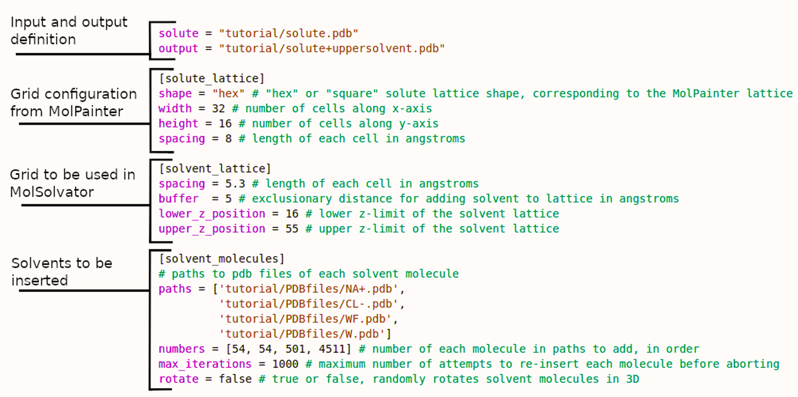

# MolPainter and MolSolvator functions

MolPainter is a novel GUI tool for constructing layered molecular systems represented using PDB files. The complementary command line MolSolvator is a simple lattice-based solvation tool for use in solvating molecular systems constructed with MolPainter.

The purpose of MolPainter is to enable the construction of complex multilayered molecular systems through fine control over the position of individual molecules, using the allegory of painting as a means by which to select these positions in cartesian coordinates.

## MolPainter objects and functions
![Figure 1. MolPainter components and functions. (A) *n* layers defined at assigned z-axial coordinates in angstrom units. (B) the grid used to define the xy-plane position of each lipid in terms of a cell spacing in angstrom units and number of cells in the x- and y-dimension. (C) The molecules are defined by PDB files supplied by the user. (D) Anchor points, defined in PDB files using B-factors of 1.00, define where the centroid of all anchor points z-axially align into the grid layer pained upon. (E) The canvas holds labels of each molecule painted onto xy-positions in each grid on each layer via various painting tools, such as the spray can. (G) Solutes can be inserted to the canvas, such as the C99 protein monomer shown here,[@Pantelopulos2022] obfuscating cells across multiple grid layers to prevent clashes with painted molecules.\label{fig:MolPainterFigure}](tutorial/images/MolPainterObjectsAndFunctions.png)

### Layers
Systems in MolPainter are represented by one or more layers. Each layer is represented by a grid defined at a given position on the Z-axis (Figure 1.A). This enables the creation of layered systems as well as simple three-dimensional structures.

### The Grid

Each layer is characterized by a grid which serves as a "canvas" for (I) precise placement (painting) of molecules in space relative to other molecules and (II) the precise counting of molecules while painting the grid. Each cell in the grid is a square cell with a length given in angstroms, defined as the cell spacing (Figure 1.B). The width (X-axis) and the height (Y-axis) of the grid is defined by the number of cells in each dimension. It should be noted that the grid is only for relative spatial placement and that there is no representation of the underlying geometry of the molecules.

### Molecules
Molecules are the primary input of the application and are configurable both in terms of how they are represented in the painting process and how they are generated in the exported system. For painting purposes, each molecule is assigned a name and a color, which serve to identify it among other molecules. Within each layer, the number and mol% of each molecule is tracked with a counter. The mol% is a volume-independent measure of the relative quantity of chemical species in a system. Typically in lipid bilayers, which is the main application for MolPainter, mol% is used to measure the relative amount of lipids and other molecules in a layer. This enables construction of a system with a desired amount or ratio of different molecule types.

For system construction (export) purposes, each molecule is associated with a PDB file and a set of optional rotational transformations to be applied during export. The PDB file is read during export and its entire contents are replicated for each instance (painted cell) of that molecule in the painting (Figure 1.C). The X and Y coordinates of the painted cell are determined by its placement in the grid; its Z coordinate is determined by the Z coordinate of the containing layer. When exporting, the X, Y, and Z coordinates of each molecule are translationally transformed to align with the X, Y, and Z coordinates of each painted cell.

The coordinates of each molecule can be transformed by rotating 180˚ over the X-axis. This transformation is uniformly applied to each painted instance of the molecule type. The molecules can also be randomly rotated around the Z-axis. This transformation is applied with a new random value for each painted instance of the molecule type. The transformations can be used for such purposes as flipping lipids to form bilayers and randomly rotating the orientations of proteins in the XY-plane.

Upon exporting, the topological data from the PDB file of each molecule is employed to assign atom numbers and residue indices of each atom in the system, ordered by the appearance of each molecule type in the palette. The coordinates of the system can be exported in a square or hexagonal lattice, wherein the hexagonal lattice is defined by shifting Y-axial positions of cells in every other X-axial column up by one-half the cell spacing.

### Anchoring Molecules to Layers
Within the PDB file a single atom or multiple atoms (for which the average position is taken) can be assigned as an "anchor point" for aligning the Z coordinates of each molecule with the Z coordinate of each layer. These Z-axial alignment atoms are defined by providing a value of "1" in the B-factor field of the PDB file (Figure 1.D). If no atoms are assigned for anchoring, the average Z-axial position of all atom coordinates in the molecule will be used to determine the anchor point.

### The Palette
The palette is used to select molecule types to be painted. The palette initially contains the empty molecule and expands as the user configures additional molecule types. The tracking information for each molecule (number and mol%) is shown in the palette for quick reference.

### Painting Tools
There are three painting tools available. By clicking on the icon or using shortcuts the user can use (I) the pencil tool (click+drag) to paint a single cell at a time, (II) the rectangle tool (ctrl+click+drag) to paint a rectangular selection of the grid, and (III) the spray can (shift+click+drag) to paint multiple cells around the cursor based on the spray radius (Figure 1.E). Erasing is performed by selecting the "empty" molecule type and using any of the aforementioned drawing tools to paint the corresponding cells with no molecule.

### Blends
Blends are special palette entries that can be painted in the same way as ordinary molecules, but represent a combination of multiple molecule types (Figure 1.F). The molecules in the blend are selected by the user from the list of existing molecule definitions, and are weighted to produce the desired ratio. When blends are painted, the cells are populated with a random molecule from the blend according to the weights.

### Saving and Loading
Saving the project allows the user to preserve molecule definitions, blends, layers, and painted cells across multiple sessions. The option to make copies of each source PDB file is presented to facilitate the sharing of projects between workstations or users, thereby avoiding path discrepancies. Saving the project is not the same as exporting; it retains the painting, but does not construct the molecular system.

### Adding Solutes
Solutes, such as large molecules that may be desirable to embed in layers of smaller, painted molecules, can be inserted into paintings. The topology and coordinates of a solute are given to MolPainter via providing a path to a PDB file. The solute will obstruct all cells that come within a "buffer space" distance in angstroms from any atom in the solute (Figure 1.G). The solute coordinates can be translated such that the center of geometry is anchored to the center of the XY-plane to a Z coordinate specified in angstroms. Additionally, there is an option to automatically expand the grid dimensions to accommodate an imported solute.

### Buttons
* Topbar buttons
    - **New** resets everything in MolPainter.
    - **Open Painting** loads a saved MolPainter state so you can continue changing your painting.
    - **Save Painting** saves a MolPainter state for later! This is a JSON-format file.
    - **Export System** constructes your painted system in PDB format. You can construct your system on square lattices or hexagonal lattices.
    - **Import Solute** *NEW IN 1.1!!* inserts a solute (PDBfile) to the MolPainter canvases, obstructing cells occupied by the solute coordinates and outputting the solute with the painting when exported.
    - **New Molecule** loads a PDB file corresponding to a molecule you wish to paint with. You can also set all painted copies of the molecule to be randomly rotated around the z-axis or be flipped 180˚ over the x-axis (like for lipid bilayers).
    - **New Blend** makes a "blend" of molecules. Blends draw molecules onto layer canvases with a weighted probability, running a RNG to determine which of the molecules that compose the blend are painted given their weighted probability.
    - **New Layer** makes new layers to paint on, defined by a z-axial position.
    - **Grid Size** sets the lattice width - the number of cells in each layer along the x-axis, the lattice height - the number of cells in each layer along the y-axis, the lattice spacing - the length of *each* cell, and the major gridline spacing, used for visual guidance when painting. 

* Toolbox buttons
    - **Magnifying glass -** zooms out from the lattice view.
    - **Magnifying glass +** zooms in on the lattice view.
    - **Pencil** enables the pencil drawing tool. Click and hold to draw selected molecule/blend.
    - **Square** enables the square selection tool. Click position to start drawing a rectilinear shape, hold, move, and release at position to fill selected molecule/blend into the rectilinear shape. *Can also be used via a ctrl+click shortcut*
    - **Spray can** sprays selected molecule/blend into an area. *Can also be used via a shift+click shortcut*
    - **Spray radius** adjust the radius of the spray can.

### Usage

Refer to the [tutorial](tutorial/README.md) for a detailed example featuring the use of the functions of MolPainter

## MolSolvator functions and usage

MolSolvator solvates systems by inserting solvent molecules into a three dimensional grid of cells corresponding to the XY-plane dimensions of systems produced in MolPainter now referred to as the "solute." The number of cells and cell length in the X- and Y-dimension of the system exported by MolPainter are defined and used to determine the XY-plane bounds of the cells for the solvent. The number of solvent cells in the X- and Y-dimension is determined by a cell spacing for the solvent unique from the cell spacing of the solute system, typically corresponding to the first solvation shell of the smallest solvent molecule in angstroms. The position and number of solvent cells in the Z-dimensions is determined by the cells which can fit within the lower and upper bounds of user-defined positions in the Z coordinate.

MolSolvator inserts molecules into the solvent cells in a quantity and using topology and coordinates specified in a list of PDB file paths and a list of the number of each molecule. When MolSolvator fails to add a solvent molecule to the lattice due to overlaps with obstructed neighboring lattice sites, it will fail and attempt to add the molecule to another randomly selected lattice site until reaching a user-specified maximum number of failures. Solvent molecules can be randomly rotated in three dimensions upon each insertion attempt, both to achieve an anisotropic mixture of solvent molecules and to succeed at finding orientations of large molecules that fit into the solvent box. It is recommended that larger solvents be inserted first such that difficulties in finding grids and rotations of each inserted solvent are avoided.

### MolSolvator Input Parameters

The MolSolvator command line tool *molsolvator* is run with a handful of options. It is principally controlled via an input file which determines the dimensions of the XY-plane into which solvent will be placed based on dimensions and cell spacing of a corresponding MolPainter system grid, the solute lattice. Using the solute lattice, the solvent lattice of cells is defined using a cell spacing, buffer distance for obstructing neighbor cells, and the lower and upper bounds of the solvent lattice Z-dimension. The solvent molecules are defined by paths to each PDB file, number of molecules to be inserted, maximum number of iterations to attempt to insert each molecule, and an option to enable random three-dimensional rotation of each molecule prior to attempting insertion. These options are input with the *-i* flag in TOML format. There are additional options to center the system at (X,Y,Z) = (0,0,0) after solvation via the *-centerc* flag, or to translate the coordinates such that the minimum Z-dimensional position to one-half the solvent cell spacing via the *-zeroz* flag. The input file fields are as follows.

* **solute** Path to a PDB file of the system to be solvated, prepared by MolPainter or otherwise.
* **output** Path for the output system following solvation.
* **[solute_lattice]**
  * **shape** "hex" or "square", determines dimensions of XY-plane.
  * **width** Number of cells in the X-dimension describing the solute system.
  * **height** Number of cells in the Y-dimension describing the solute system.
 * **spacing** Cell spacing defining the solute system in angstroms.
* **[solvent_molecules]**
  * **paths** Cell spacing defining the solvent cells in angstroms.
  * **numbers** Number of each solvent given in **paths** to insert to solvent cells, in order.
  * **max_iterations** Number of attempts to re-insert a molecule to available cells before aborting.
  * **rotate** "true" or "false" enabling three-dimensional rotation solvent molecules in each insertion attempt.
  * **seed** Optionally set the random seed