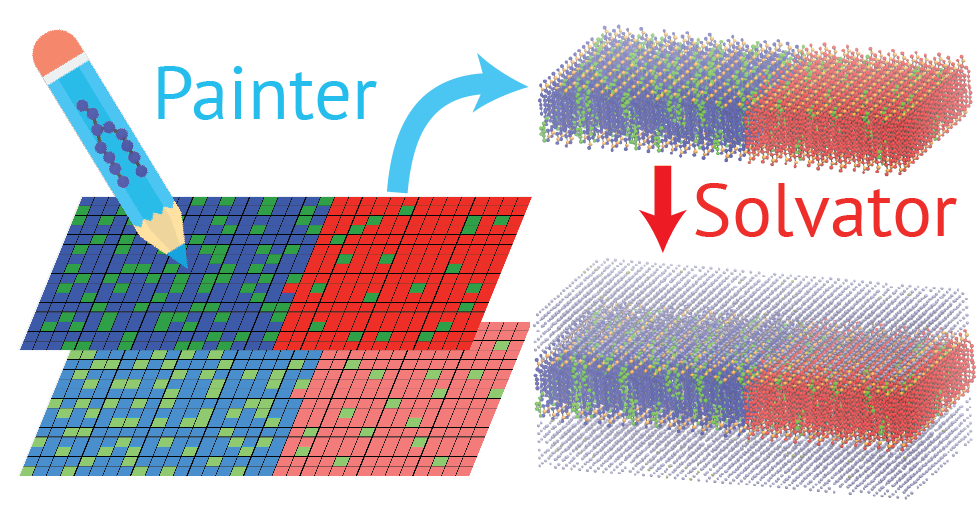
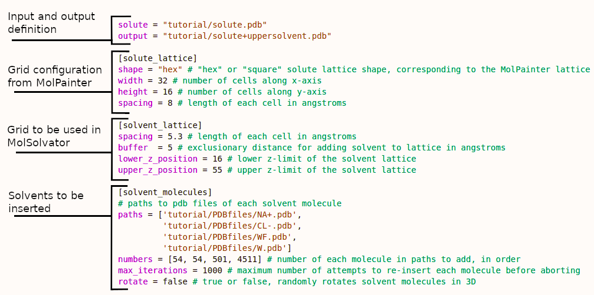

# Summary

MolPainter presents the metaphor of painting as an abstraction for the construction of complex layered molecular systems. In particular, systems whose equilibrium states exhibit distinctive visual artifacts can be intentionally crafted through interactive, visually-oriented molecule placement. This is in contrast to non-interactive methods, which allow neither manual placement of molecules nor visual confirmation of desired states. The principal use-case is presented for modelling lipid bilayers with molecular dynamics simulation, though MolPainter may be used to construct any layered molecular system provided appropriate PDB-format files to define molecules.

# Statement of Need

Complexity in systems investigated using molecular dynamics (MD) and similar simulation methods employing MD force fields is increasing in terms of composition, initial condition, and system size. Due to limitations in time scales accessible even in highly coarse-grained force fields, careful selection of molecular composition and initial positions in complex systems is essential to designing useful simulations. With current tools for preparing molecular systems, it is straightforward to construct systems of complex composition but with random placement of molecules in the system. From such random initial distributions, systems would typically need very long, potentially intractable time scales to reach equilibrium. Construction of complex systems of realistic compositions, such as the *Mycoplasma genitalium* cell,[@Yu2016] are impressive, though it is difficult to construct any non-random initial positions for such systems.

Several useful tools have been made available for the construction of complex molecular systems. Tools for off-lattice random insertion of molecules such as PACKMOL[@Martinez2009] and the insert-molecules program in GROMACS,[@VanDerSpoel2005] enable construction of off-lattice molecular systems by placement of randomly translated and rotated molecules into user-defined volumes with optional restraints on specific atom positions. Tools for phase-specific preparation of simulations such as CHARMM-GUI,[@Jo2008] PACKMOL-MemGen,[@Schott-Verdugo2019] and insane.py[@Wassenaar2015] for all-atom and coarse-grained lipid bilayer simulations are popular and widely used, and handle complex lipid mixtures by allowing the user to control the number and identity of lipids of  lipids randomly, laterally placed within two flat leaflets. These programs also provide support for the inclusion of solutes, such as transmembrane proteins. Similar tools for constructing arbitrary, flat bilayers such as MemGen[@Knight2015], vesicles with insane.py and CHARMM-GUI, and more complex curved geometries with BUMPy[@Boyd2018] and LipidWrapper[@Durrant2014], which also insert lipids and other molecules in a random, lateral distribution, provide for more flexibility and creativity in system construction though with less complete support in preparing the system for simulation.

However, there is a lack of tools to assist in the fine-tuning of the spatial placement of molecules in lipid bilayers, and more generally into any layered geometry. Lipid membranes are believed to exhibit specific, functional clusters of lipids, cholesterol, and proteins, often generally referred to as lipid rafts.[@Sych2021] Lipid rafts are characterized by the liquid ordered ($\mathrm{L_o}$) lipid phase, unique from the liquid disordered phase ($\mathrm{L_d}$) of the bulk membrane. The formation of the $\mathrm{L_o}$ lipid phase and phase separation from the $\mathrm{L_d}$ phase is an example of a long time scale phenomenon which is computationally intractable in all-atom MD simulation. However, as the phase diagrams of ternary lipid mixtures and cholesterol have been characterized, it is possible to estimate *a priori* whether the lipid bilayer should be phase separated, and it is also possible to infer the relative concentration of cholesterol in $\mathrm{L_o}$ and $\mathrm{L_d}$ phases. With an appropriate tool for the task, it should be possible to model phase-separated states with a near-equilibrium initial spatial placement of lipids which can then be equilibrated using conventional all-atom MD simulation.

The shape of such molecular phase separations and clusters can also be  unique. The $\mathrm{L_o}$ phase at high cholesterol concentrations has been proposed to form "threads" of cholesterol, in which each cholesterol has no more and no less than two cholesterol in the first solvation shell, manifesting a maze-like pattern.[@Huang1999; @Miao2002; @Pantelopulos2018a] This has been proposed to either be due to unfavorable penetration of water introduced by loss of protective lipid headgroups or specific cholesterol-cholesterol interactions involving the $\alpha$ and $\beta$ faces of cholesterol.[@Bandara2017] The shape and size of lipid phase separations can also vary significantly, manifesting as stripes or dots in vesicles[@Pantelopulos2017] and molecular simulations with varying system dimensions and line tensions between the $\mathrm{L_o}$ and $\mathrm{L_d}$ phase.[@Kwon2022]

There is also a great deal of speculation about specific pairwise interactions between lipids, cholesterol, and proteins. Simulations exploring such so-named "molecular fingerprints"[@Corradi2019] and cholesterol binding sites[@Song2014a] has relied on using the equilibrium state of coarse-grained simulations as a guess at the equilibrium state of an all-atom simulation, and are used as priors for such all-atom simulations which cannot reach the time scales required to observe spatial reorganization of the lipid bilayer. As such, investigations of protein-lipid and protein-cholesterol interactions rely on coarse-grained force fields for proposing hypothetically important interactions, rather than proposing initial distributions of lipids and cholesterol that might be hypothetically interesting.

We have developed a GUI-based program, MolPainter, to assist with the construction of complex layered molecular systems through the concept of painting. Through the use of user-provided PDB files, MolPainter can be used to paint molecules onto a canvas, a lattice in the xy-plane, aligning each molecule to a specific xy-coordinate and specific z-positions defined for any number of canvases. MolPainter also supports the inclusion of a "solute" to the painting, allowing for ease in constructing unique environments defined by complex mixtures of solvents. With MolPainter we include a light companion script, MolSolvator, for the addition of bulk solvent to systems painted using MolPainter. These generalized tools enable the construction of unique initial structures of complex layered molecular systems, such as lipid bilayers. MolPainter and MolSolvator may find particular use as tools for testing hypotheses about the stability of specific initial lateral distributions of molecules and the specific interaction of solutes with various solvents. 

# Components and Functionality

MolPainter is built around a Tk-based GUI. Tk was chosen to deliver native GUI elements on every operating system without installing any additional packages. Computations within the program are aided by the NumPy and SciPy packages. The exported systems are constructed using the MDAnalysis package. 

Several plaintext formats are used to facilitate human editing of project files outside of MolPainter. Saving the project generates a JSON file that exposes project configuration variables as key/value pairs while serializing the painting. The MolSolvator configuration files use TOML for increased readability.

## MolPainter

Each layer is characterized by a grid which serves as a "canvas" for (I) precise placement (painting) of molecules in space relative to other molecules and (II) the precise counting of molecules while painting the grid. Each cell in the grid is a square cell with a length given in angstroms, defined as the cell spacing. The width (X-axis) and the height (Y-axis) of the grid is defined by the number of cells in each dimension.

It should be noted that the grid is only for relative spatial placement and that there is no representation of the underlying geometry of the molecules.

![MolPainter components and functions. (A) *n* layers defined at assigned z-axial coordinates in angstrom units. (B) the grid used to define the xy-plane position of each lipid in terms of a cell spacing in angstrom units and number of cells in the x- and y-dimension. (C) The molecules are defined by PDB files supplied by the user. (D) Anchor points, defined in PDB files using B-factors of 1.00, define where the centroid of all anchor points z-axially align into the grid layer pained upon. (E) The canvas holds labels of each molecule painted onto xy-positions in each grid on each layer via various painting tools, such as the spray can. (G) Solutes can be inserted to the canvas, such as the C99 protein monomer shown here,[@Pantelopulos2022] obfuscating cells across multiple grid layers to prevent clashes with painted molecules.\label{fig:Figure2}](figures/Figure2.png)

### Layers
Systems in MolPainter are represented by one or more layers. Each layer is represented by a grid defined at a given position on the Z-axis (Figure \autoref{fig:Figure2}.A). This enables the creation of layered systems as well as simple three-dimensional structures.

### The Grid

Each layer is characterized by a grid which serves as a "canvas" for (I) precise placement (painting) of molecules in space relative to other molecules and (II) the precise counting of molecules while painting the grid. Each cell in the grid is a square cell with a length given in angstroms, defined as the cell spacing (Figure \autoref{fig:Figure2}.B). The width (X-axis) and the height (Y-axis) of the grid is defined by the number of cells in each dimension. It should be noted that the grid is only for relative spatial placement and that there is no representation of the underlying geometry of the molecules.

### Molecules
Molecules are the primary input of the application and are configurable both in terms of how they are represented in the painting process and how they are generated in the exported system. For painting purposes, each molecule is assigned a name and a color, which serve to identify it among other molecules. Within each layer, the number and mol% of each molecule is tracked with a counter. This enables construction of a system with a desired amount or ratio of different molecule types.

For system construction (export) purposes, each molecule is associated with a PDB file and a set of optional rotational transformations to be applied during export. The PDB file is read during export and its entire contents are replicated for each instance (painted cell) of that molecule in the painting (Figure \autoref{fig:Figure2}.C). The X and Y coordinates of the painted cell are determined by its placement in the grid; its Z coordinate is determined by the Z coordinate of the containing layer. When exporting, the X, Y, and Z coordinates of each molecule are translationally transformed to align with the X, Y, and Z coordinates of each painted cell.

The coordinates of each molecule can be transformed by rotating 180$^\circ$ over the X-axis. This transformation is uniformly applied to each painted instance of the molecule type. The molecules can also be randomly rotated around the Z-axis. This transformation is applied with a new random value for each painted instance of the molecule type. The transformations can be used for such purposes as flipping lipids to form bilayers and randomly rotating the orientations of proteins in the XY-plane.

Upon exporting, the topological data from the PDB file of each molecule is employed to assign atom numbers and residue indices of each atom in the system, ordered by the appearance of each molecule type in the palette. The coordinates of the system can be exported in a square or hexagonal lattice, wherein the hexagonal lattice is defined by shifting Y-axial positions of cells in every other X-axial column up by one-half the cell spacing.

### Anchoring Molecules to Layers
Within the PDB file a single atom or multiple atoms (for which the average position is taken) can be assigned as an "anchor point" for aligning the Z coordinates of each molecule with the Z coordinate of each layer. These Z-axial alignment atoms are defined by providing a value of "1" in the B-factor field of the PDB file (Figure \autoref{fig:Figure2}.D). If no atoms are assigned for anchoring, the average Z-axial position of all atom coordinates in the molecule will be used to determine the anchor point.

### The Palette
The palette is used to select molecule types to be painted. The palette initially contains the empty molecule and expands as the user configures additional molecule types. The tracking information for each molecule (number and mol%) is shown in the palette for quick reference.

### Painting Tools
There are three painting tools available. By clicking on the icon or using shortcuts the user can use (I) the pencil tool (click+drag) to paint a single cell at a time, (II) the rectangle tool (ctrl+click+drag) to paint a rectangular selection of the grid, and (III) the spray can (shift+click+drag) to paint multiple cells around the cursor based on the spray radius (Figure \autoref{fig:Figure2}.E). Erasing is performed by selecting the "empty" molecule type and using any of the aforementioned drawing tools to paint the corresponding cells with no molecule.

### Blends
Blends are special palette entries that can be painted in the same way as ordinary molecules, but represent a combination of multiple molecule types (Figure \autoref{fig:Figure2}.F). The molecules in the blend are selected by the user from the list of existing molecule definitions, and are weighted to produce the desired ratio. When blends are painted, the cells are populated with a random molecule from the blend according to the weights.

### Saving and Loading
Saving the project allows the user to preserve molecule definitions, blends, layers, and painted cells across multiple sessions. The option to make copies of each source PDB file is presented to facilitate the sharing of projects between workstations or users, thereby avoiding path discrepancies. Saving the project is not the same as exporting; it retains the painting, but does not construct the molecular system.

### Adding Solutes
Solutes, such as large molecules that may be desirable to embed in layers of smaller, painted molecules, can be inserted into paintings. The topology and coordinates of a solute are given to MolPainter via providing a path to a PDB file. The solute will obstruct all cells that come within a "buffer space" distance in angstroms from any atom in the solute (Figure \autoref{fig:Figure2}.G). The solute coordinates can be translated such that the center of geometry is anchored to the center of the XY-plane to a Z coordinate specified in angstroms. Additionally, there is an option to automatically expand the grid dimensions to accommodate an imported solute.

## MolSolvator

MolSolvator solvates systems by inserting solvent molecules into a three dimensional grid of cells corresponding to the XY-plane dimensions of systems produced in MolPainter  now referred to as the "solute." The number of cells and cell length in the X- and Y-dimension of the system exported by MolPainter are defined and used to determine the XY-plane bounds of the cells for the solvent. The number of solvent cells in the X- and Y-dimension is determined by a cell spacing for the solvent unique from the cell spacing of the solute system, typically corresponding to the first solvation shell of the smallest solvent molecule in angstroms. The position and number of solvent cells in the Z-dimensions is determined by the cells which can fit within the lower and upper bounds of user-defined positions in the Z coordinate.

MolSolvator inserts molecules into the solvent cells in a quantity and using topology and coordinates specified in a list of PDB file paths and a list of the number of each molecule. When MolSolvator fails to add a solvent molecule to the lattice due to overlaps with obstructed neighboring lattice sites, it will fail and attempt to add the molecule to another randomly selected lattice site until reaching a user-specified maximum number of failures. Solvent molecules can be randomly rotated in three dimensions upon each insertion attempt, both to achieve an anisotropic mixture of solvent molecules and to succeed at finding orientations of large molecules that fit into the solvent box. It is recommended that larger solvents be inserted first such that difficulties in finding grids and rotations of each inserted solvent are avoided.

### MolSolvator Input Parameters

The MolSolvator command line tool *molsolvator* is run with a handful of options. It is principally controlled via an input file which determines the dimensions of the XY-plane into which solvent will be placed based on dimensions and cell spacing of a corresponding MolPainter system grid, the solute lattice. Using the solute lattice, the solvent lattice of cells is defined using a cell spacing, buffer distance for obstructing neighbor cells, and the lower and upper bounds of the solvent lattice Z-dimension. The solvent molecules are defined by paths to each PDB file, number of molecules to be inserted, maximum number of iterations to attempt to insert each molecule, and an option to enable random three-dimensional rotation of each molecule prior to attempting insertion. These options are input with the \texttt{-i} flag in TOML format. There are additional options to center the system at (X,Y,Z) = (0,0,0) after solvation via the \texttt{-centerc} flag, or to translate the coordinates such that the minimum Z-dimensional position to one-half the solvent cell spacing via the \texttt{-zeroz} flag. The input file fields are as follows.

* **solute** Path to a PDB file of the system to be solvated, prepared by MolPainter or otherwise.
* **output** Path for the output system following solvation.
* **[solute_lattice]**
<ul>
  <li>**shape** "hex" or "square", determines dimensions of XY-plane.</li>
  <li>**width** Number of cells in the X-dimension describing the solute system.</li>
  <li>**height** Number of cells in the Y-dimension describing the solute system.</li>
 <li> **spacing** Cell spacing defining the solute system in angstroms.</li>
</ul>
* **[solvent_molecules]**
<ul>
  <li>**paths** Cell spacing defining the solvent cells in angstroms.</li>
  <li>**numbers** Number of each solvent given in \textbf{paths} to insert to solvent cells, in order.</li>
  <li>**max_iterations** Number of attempts to re-insert a molecule to available cells before aborting.</li>
  <li>**rotate** "true" or "false" enabling three-dimensional rotation solvent molecules in each insertion attempt.</li>
</ul>

# Availability

MolPainter is available on PyPi and the source is hosted on GitHub at https://github.com/gpantel/MolPainter/tree/master including additional documentation.

# Acknowledgements

We acknowledge conversations with John Straub (Boston University) regarding potential MolPainter functions and applications.

# References